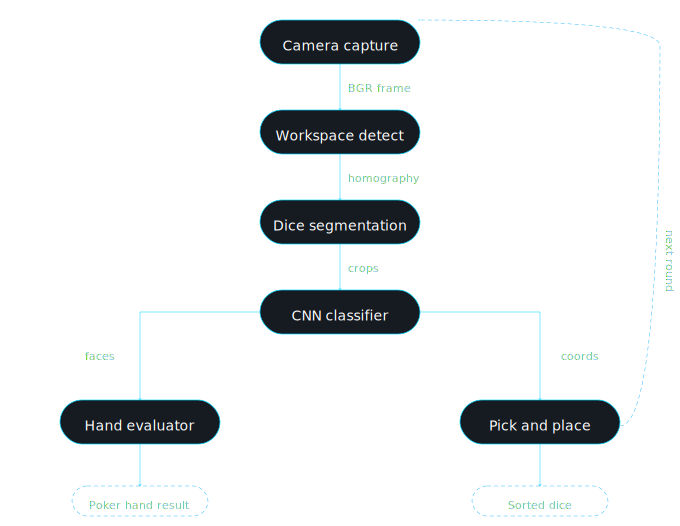
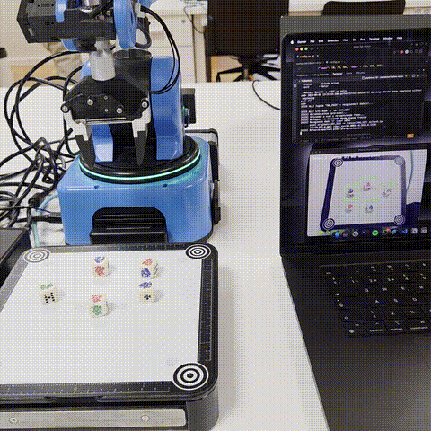
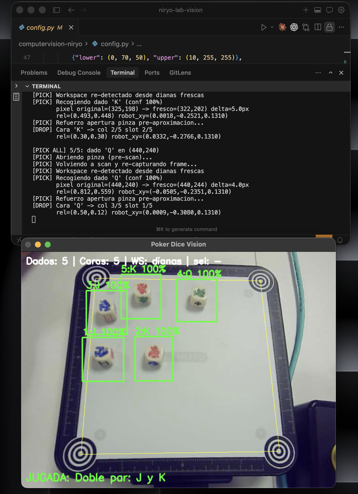

# Niryo Poker Dice Vision

For this lab we had the challenge of building a complete robotic vision system on top of the Niryo One arm. The goal was not only to detect shapes on a workspace — we already did that in Lab 1 — but to take the next step and add real semantic meaning to the scene. Our objective was that the robot could look at a set of poker dice lying on a table, understand which face each die was showing, evaluate the resulting poker hand, and then physically group the dice according to the hand it had detected.

What we did was integrate everything we had seen in the course into a single application: classical computer vision with OpenCV for the workspace calibration and dice segmentation, a convolutional neural network trained from scratch in PyTorch to recognise the six dice faces (`9`, `10`, `J`, `Q`, `K`, `A`), ONNX Runtime for fast inference on the same machine that controls the robot, and `pyniryo` for the actual pick-and-place. The result is an end-to-end pipeline where the camera, the model and the gripper work together in real time.

The diagram above shows the flow of the system. The camera sends a frame, the vision module extracts the workspace and the dice, the classifier turns every crop into a face label, the evaluator decides the poker hand, and finally the robot controller moves the arm to pick and place each die in its assigned column.

---

## The first challenge: seeing and understanding the dice

The first challenge was not easy at all. The dice in the lab are white and the workspace is also white, so segmenting them by colour simply does not work. We had to rely on **edge detection** instead. The pipeline begins with the four concentric targets that are printed on the corners of the board. Using `HoughCircles` we detect them, we sort them by proximity to the image corners to identify TL, TR, BR, BL, and we build a homography that maps every pixel to a normalised `[0, 1] × [0, 1]` coordinate system. This homography is the bridge between the image world and the robot world — every coordinate we compute later is relative to it, and it is the reason why our code stays clean on both sides.

Once the workspace is calibrated, we look for the dice. We apply a Canny edge detector on the grayscale image, we mask the inside of the workspace to ignore the dark frame, we dilate and close the edges to turn them into solid contours, and finally we extract the contours that fall inside a reasonable area range. We also discard any contour that is too close to the four corner targets, because otherwise the targets themselves would be detected as dice. For every valid contour we crop the bounding rectangle with a small padding and we pass it to the classifier.

Detecting the dice is only half of the problem, though. The really interesting part is **recognising which face each die is showing**, and for that we needed a neural network.

---

## Training the CNN: a lot of data capture

We took the dataset capture very seriously, because we knew that the quality of the model would depend almost entirely on the quality and variety of the training images. We wrote a dedicated `capture.py` script that connects to the robot, lowers the camera to a pose where the dice fill more pixels in the image (around 80–100 px instead of 40 px), and lets us label each crop either interactively or with a fixed label per session. We ran several capture sessions with different light conditions, different die positions and different rotations, and we ended up with about one thousand images distributed across the six classes, with roughly 150 to 200 images per face.

The network itself is a simple but effective architecture. It has three convolutional blocks of `Conv → BatchNorm → ReLU → MaxPool` that reduce the `64 × 64 × 3` input down to `128 × 8 × 8`, followed by a fully-connected head with dropout that outputs six logits, one per class:

| Layer                          | Input         | Output        |
| ------------------------------ | ------------- | ------------- |
| Conv + BN + ReLU + MaxPool     | 3 × 64 × 64   | 32 × 32 × 32  |
| Conv + BN + ReLU + MaxPool     | 32 × 32 × 32  | 64 × 16 × 16  |
| Conv + BN + ReLU + MaxPool     | 64 × 16 × 16  | 128 × 8 × 8   |
| Flatten + Dropout + FC + ReLU  | 8192          | 256           |
| Dropout + FC (logits)          | 256           | 6 classes     |

We trained for 50 epochs using Adam (learning rate `1e-3`, weight decay `1e-4`), cross entropy loss, and data augmentation with random rotations, horizontal flip, colour jitter and small affine translations. To compensate the slight class imbalance we also used a weighted random sampler.

The best checkpoint reached **98.5% validation accuracy**, with only three mistakes in the whole validation set — and all three of them were between the faces `9` and `10`, which are visually the closest pair on these dice. After training we exported the model to ONNX, so we could run it with ONNX Runtime directly on the laptop that controls the robot, with a latency of only a few milliseconds per crop.

In the GIF above we can see the classifier working live on the robot's camera feed. Each die is recognised with high confidence (most of the time 100%), and the overall poker hand is displayed at the bottom of the screen in real time.

---

## Evaluating the poker hand

With the faces detected, the next step was to turn the list of faces into a hand. We wrote a small evaluator with the standard poker dice hierarchy:

> **Nothing → Pair → Two Pair → Three of a Kind → Straight → Full House → Poker (four of a kind) → Repoker (five of a kind).**

The function receives a list of faces, counts how many times each one appears, and returns the hand name together with a human-readable description (for example, `"Trío de J"` or `"Full House: trio de 9, par de K"`) which is then drawn directly over the OpenCV window.

This is the terminal showing the hand identification and the first pick-and-place operations running on top of it. The interesting part here is how simple this step is once the CNN works well: the evaluator itself is less than one hundred lines of code, because all the hard perception has already been solved by the previous modules.

---

## The second challenge: pick and place by columns

Once the hand was correctly recognised, the second big challenge was the physical side of the problem. We wanted the robot to pick up the dice and group them in a way that communicates the structure of the hand just by looking at the table.

Our first idea was "one column per hand type", which means that all the dice of a Two Pair would go to a single column. But we quickly saw that this was not very informative — in a Two Pair you want to see the two pairs as two separate groups, not merged into one line. So we changed the logic and we decided that **every distinct face gets its own column**. The dice that share the same face are stacked vertically in that column, in separate Y slots.

With this rule a Two Pair `(9, 9, J, J, K)` is physically arranged on the table as three columns: one with the two 9s, one with the two Js, and one with the single K. A Full House becomes two columns (the trio and the pair). A Repoker becomes one single column of five dice. The physical arrangement itself communicates the hand, which we think is a nice property of the design.

The pick-and-place routine was also more difficult than we expected. Because the gripper of the Niryo is a bit wide, the first version of our columns was too close to each other and the gripper could touch a neighbour column. We had to open the separation by at least 30%, and in the final version we use five columns with a `0.20` normalised separation on the X axis of the workspace, which gives around 3 cm of real space between columns — enough for the gripper to move comfortably. The Z height used for the drop is the same as the one used for the pick, so the dice are simply placed on the table at the assigned position.

Another small but important detail was the gripper state. In our first tests we noticed that sometimes the robot went to grab the next die with the gripper still half-closed from the previous drop, and the pick failed. To fix it we added an explicit open-gripper call **right before every approach movement**, plus a slightly longer delay so the servo has time to finish the motion. We also call `release_with_tool()` and `open_gripper()` together as a safety net. From that point on, the gripper is always fully open when the robot starts a new pick.

We also implemented a `pick all` command in the terminal that groups the whole scene automatically. Behind the scenes, before each individual pick the robot goes back to the scanning pose, captures a fresh frame, re-detects the workspace from the targets and the dice with the CNN, and then chooses the die with the target face that is **closest to the original position**. This re-detection step is important because the dice may move a little when the arm passes over them, and it also makes the system much more robust against any small change in the scene.

---

## The complete flow

Putting everything together, a normal round looks like this:

1. The robot moves to the scanning pose and captures an image of the workspace.
2. The four corner targets are detected and a homography to `[0, 1] × [0, 1]` is computed.
3. The dice are segmented with Canny + morphology and cropped with padding.
4. Each crop is classified by the CNN, giving a face label and a confidence score.
5. The evaluator decides the poker hand from the list of faces.
6. On `pick all`, the robot picks every die one by one and drops it in the column of its face, stacking dice with the same face in consecutive slots.

The final GIF shows the complete pipeline running in a single take: the robot looks at the dice, the CNN classifies every face in real time, the hand is displayed on the screen, and then the arm starts picking and arranging the dice in physical columns on the workspace until the scene is empty and the hand is shown in a clean, visual way on the table.

---

## What we learned

This lab was a very good opportunity to see how far we can go by combining classical computer vision with deep learning on a real robot. The classical part gives us a reliable geometric frame: homography, segmentation and contour filtering — things that are easy to explain and easy to debug. The deep learning part adds the semantic layer that would be very hard to write by hand: recognising the face of a die has many variations of lighting, rotation, perspective and background, and a small CNN learns these variations much better than any handmade rule.

On the robotic side, the most important lesson was that the hard problems are not always the ones you expect. Reaching 98% accuracy with the CNN was actually one of the easiest steps. The tricky issues came from the physical details — the gripper state between picks, the right amount of separation between columns, re-capturing a fresh frame before every movement to compensate for small drifts of the dice — and from the coordinate mapping between the camera, the normalised workspace and the robot. Once we had a clean boundary at the `[0, 1]` normalised space, every module (vision, classifier, robot) could be developed and tested in isolation and then plugged together almost for free.

If we had to keep just one idea from this lab, it would be the importance of choosing a **clean intermediate representation**. In our case that representation is the normalised workspace: everything related to pixels lives in `vision.py`, everything related to physical coordinates lives in `robot.py`, and the two sides only talk to each other through a simple `(x_rel, y_rel) ∈ [0, 1]²` pair. That single decision is what made the whole integration feel natural.

---

